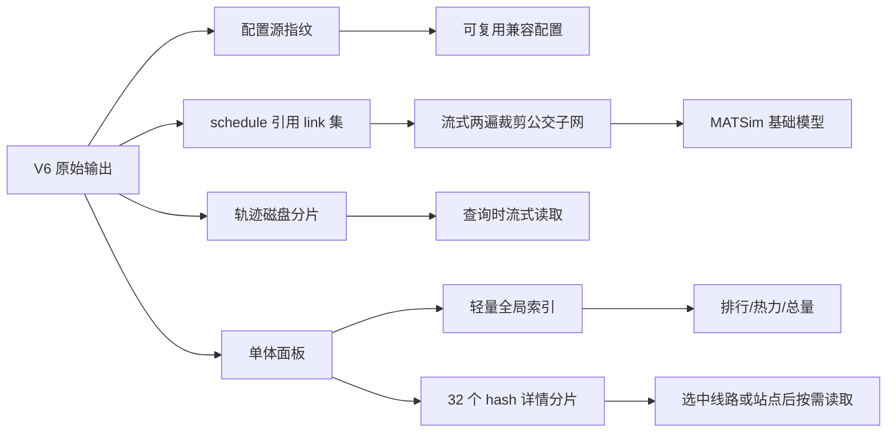

# V6 模型低内存高速加载报告（2026-07-18）

## 结论

当前本机已经可以加载 V6 模型。新加载链不再把 2,063.9 万条乘客轨迹和两份 300～400 MB 级面板 JSON 同时展开到 Java 堆中，而是采用“配置指纹复用 + 公交子网裁剪 + 轨迹磁盘驻留 + 面板索引/详情分片”的分层结构。

在本机 24 GB 内存、JDK 21、模型位于外置卷的实测中：

- V6 基础模型冷载（首次生成配置兼容文件和公交子网）为 **10.019 s**；
- V6 热载在 **`-Xmx320m`** 限制下为 **2.738 s**，加载成功；
- 热载后 GC 已用堆约 **227.2 MB**；
- 原先失败的顶层缓存清单可在 **238 ms** 内无模型加载自动修复为 ready。

这里的“冷载”指分析组件缓存已存在、但本轮新增的配置兼容文件与公交子网尚未生成。一个全新 V6 的 15 GB events 首次分析仍属于离线/后台缓存构建，不应让首位页面用户同步等待。

## 原瓶颈与故障原因

| 瓶颈 | V6 实际规模 | 原行为 | 结果 |
|---|---:|---|---|
| 乘客轨迹 | 20,639,152 条，压缩文件 287.32 MiB | 启动时反序列化为对象列表 | 按 384 B/条估算约 7.381 GiB，仅轨迹即可能耗尽堆 |
| 线路面板 | 34.68 MiB gzip，解压约 369 MB | 全量 JSON 读入并长期驻留 | 首次解析慢，多个模型时堆占用叠加 |
| 站点面板 | 40.30 MiB gzip，解压约 363 MB | 全量 JSON 读入并长期驻留 | 同上 |
| 网络 | 1,048,576 条 link，32.42 MiB gzip | 完整 MATSim network 对象化 | 大量与公交线路无关的节点/link 占堆 |
| 配置兼容 | V5/V6 原配置需升级 | 每个新对象先尝试失败，再重新转换 | 后续加载重复 XML/DTD 与失败解析成本 |
| 模型释放 | 多模型运行 | 清理任务读取模型时刷新访问时间 | 模型实际上永不因空闲而释放 |
| 顶层清单 | manager manifest 为 failed | 即使组件均完整也重新走重建 | Java heap space 后无法恢复 ready |

## 新加载架构



### 1. 配置兼容文件跨实例复用

兼容配置旁保存源路径、大小和修改时间指纹。后续 `MatsimOutFile` 实例直接读取已转换文件，不再先触发一次预期失败；源配置变化或兼容文件损坏时自动原子重建。

### 2. 仅加载公交实际引用的网络

使用 StAX 流式两遍扫描：先从 transit schedule 收集 link，再从原 network 提取这些 link 及其端点 node。V6 从 1,048,576 条 link 缩到 168,007 条，保留 142,473 个必要 node；生成文件仍由 MATSim 正式解析校验。

### 3. 大模型轨迹保持磁盘驻留

V6 的轨迹完整性仍由轻量 manifest 和记录数验证，但启动不再创建 2,063.9 万个 Java 对象。只有小模型且估算占用同时低于记录数上限和可用堆预算时才预热轨迹；大模型的接口改用预计算汇总或磁盘流式读取。

### 4. 面板改为“全局索引 + 按需详情”

首次转换采用 Jackson streaming，一次只对象化一条线路或一个站点。全局页面只读取指标、小时客流和必要标识；OD、换乘、画像、设施详情存入 32 个 hash 分片。前端选择线路/站点后才请求对应分片，并对线路上下行聚合详情并行读取。

### 5. 缓存清单自愈

顶层 manager manifest 不再决定组件是否可用。系统独立验证轨迹、线路、站点等组件；组件均完整时原子修复顶层清单，无需加载 plans/events，也不会再次触发重建。

### 6. 模型卸载策略

已加载模型不再按空闲时间或 LRU 上限自动释放，缓存构建任务结束后也保持加载。只有用户在模型管理界面执行手动卸载才会释放模型内存。

## 体积与加载实测

| 指标 | 优化前 | 优化后 | 变化 |
|---|---:|---:|---:|
| V6 network gzip | 32.420 MiB | 7.101 MiB | -78.10% |
| route panel 首屏读取文件 | 34.675 MiB | 1.236 MiB | -96.44% |
| station panel 首屏读取文件 | 40.303 MiB | 0.859 MiB | -97.87% |
| V6 冷载 | 原 manager 重建发生 Java heap space | 10.019 s | 可稳定完成 |
| V6 热载 | 依赖最高 12 GB 堆配置 | 2.738 s，`-Xmx320m` | 低堆限制下成功 |
| 热载 GC 后已用堆 | 未形成可用结果 | 约 227.2 MB | 可控 |
| 冷载进程峰值 footprint | — | 约 551.4 MB | `-Xmx768m` 测试 |
| 顶层清单恢复 | 需要重建/失败 | 238 ms | 不加载模型 |

热载测试同时验证了 168,007 条 link、142,473 个 node、57,076 个站点和 3,638 条 route 均可由 MATSim 正常装载。时间包含外置卷读取，因此内置 NVMe 上通常还会更快。

## 本机运行参数

`deploy.local.env` 已按 24 GB 本机调整为：

```bash
MATSIM_CACHE_BUILD_THREADS=1
MATSIM_PROCESSING_THREADS=4
MATSIM_CACHE_STATUS_PROBE_TTL_MS=10000
MATSIM_LOADED_MODEL_IDLE_MS=1800000
MATSIM_LOADED_MODEL_CLEANUP_MS=300000
MATSIM_MAX_LOADED_MODELS=3
JAVA_OPTS="-Xms512m -Xmx8g -XX:+UseG1GC -XX:+UseStringDeduplication"
```

`-Xmx8g` 是为普通分析接口与其他模型保留的安全余量，并不代表 V6 基础加载需要 8 GB；受控实测已在 `-Xmx320m` 下完成。不要再使用 `-Xms2g`，否则服务一启动就会无条件提交过大的初始堆。

## 正确性与运维边界

- 派生子网和面板分片都带源文件大小/修改时间指纹；源文件变化后自动失效重建。
- 所有派生输出采用临时文件/目录后原子替换，进程中断不会留下“看似 ready”的半成品。
- 后端 JDK 21 全量回归 **146 项通过、0 failure、0 error、3 项环境型测试跳过**。
- 前端 **22 个测试文件、109 项测试通过**；`vue-tsc --build` 与 Vite 生产构建均通过。
- 大模型缺少必需分析组件时会明确报错，不会用空轨迹生成并污染零值缓存。
- 全新 V6 的 events 约 15.02 GiB、plans 约 14.40 GiB；首次分析缓存应预生成，并保证外置卷在整个任务期间稳定可写。
- `deploy.sh` 已暴露线程数和状态探测 TTL 等运行配置；修改运行参数后需要重启后端生效。
