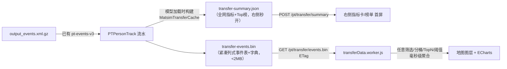

# 公交—地铁换乘分析模块设计方案（v2）

> 2026-07-13 起草；同日按外部评审意见修订为 v2（九项硬错误修复 + 口径补强，见文末 §14 修订记录）。基于用户初稿《公交地铁换乘分析模块设计.md》评审修订，全部设计已对照平台现有代码与数据核实可行性。
>
> 一句话定义：**以已加载仿真模型的事件级上下车流水（`PTPersonTrack`）为唯一数据源，识别公交↔地铁跨制式换乘事件，产出一张紧凑的"换乘事件表"下发前端，由 Worker 做任意维度的交互式聚合；页面置于"客流分析"与"线网优化"之间，首期提供 换乘总览 / 换乘枢纽 / 接驳公交线路 / 换乘衔接 四个视角，P1 补方案对比，P2 补来源去向。**

---

## 目录

1. [初稿评审结论](#1-初稿评审结论)
2. [数据可行性与既有底座](#2-数据可行性与既有底座)
3. [统一口径定义（核心）](#3-统一口径定义核心)
4. [总体架构：小事件表 + 前端 Worker 聚合](#4-总体架构小事件表--前端-worker-聚合)
5. [页面布局与导航接入](#5-页面布局与导航接入)
6. [子模块设计](#6-子模块设计)
7. [地图可视化规格](#7-地图可视化规格)
8. [ECharts 图表规格](#8-echarts-图表规格)
9. [后端设计](#9-后端设计)
10. [前端设计](#10-前端设计)
11. [数据结构定义](#11-数据结构定义)
12. [分期实施路线](#12-分期实施路线)
13. [关键决策与风险](#13-关键决策与风险)
14. [修订记录（v1→v2）](#14-修订记录v1v2)

---

## 1. 初稿评审结论

初稿方向正确（六模块划分、左中右布局、方向切换、Top N 控制均予保留），但按平台现状需要收口径、砍规格。逐项处理如下：

| 初稿内容 | 处理 | 理由 |
|---|---|---|
| 六个子模块划分 | **保留**，分期调整：首期 4 个，方案对比挪 P1，来源去向挪 P2 | 方案对比依赖双模型换乘缓存 + 优化评估骨架，复杂度中等；来源去向需新增 trips/activities 解析，最重（初稿也建议二期） |
| 统一筛选「统计迭代」 | **砍掉** | 平台只消费最终迭代的顶层 output（`MatsimOutFile` 仅扫 `ITERS/` 抓真实计数对比文件），不存在迭代级选择，全平台无此概念 |
| 统一筛选「是否显示扩样结果」 | **砍掉**，统一默认扩样 | 与运行监测/客流分析口径一致：绝对量 ÷ scale 还原全量，比率/时间类量纲自然抵消，无需开关 |
| 统一筛选「最大换乘时间阈值」 | **拆成两个**：识别窗口固定 30min（缓存口径）；"长换乘"阈值前端可调（默认 15min） | 识别窗口进缓存，改动必须 bump 版本；展示阈值基于分钟直方图在前端任意计算，互不干扰 |
| 时间粒度 15/30/60 分钟 | **保留** | 事件表架构下前端 Worker 任意分桶，零后端成本（见 §4） |
| 「平均候车时间」指标 | **挪 P2** | events 通道未解析等待事件，`PTPersonTrack` 只有上下车时刻；换乘时间无法拆步行/候车，P2 可从 `output_legs.csv.gz` 的 `wait_time` 列补 |
| 双地图模式、卷帘对比 | **砍掉** | 平台是单地图共享架构（`MapLayout` 提供唯一 `MyMap` 实例），双地图/卷帘等于重做地图层，收益不成比例；差值气泡单地图足够 |
| 风险闪烁 / 描边动画 | **砍掉**，改静态描边 + 置顶排序 | 与 PRODUCT.md 克制风格冲突；full-stack-audit 已记录 Deck 图层各自注册 rAF 的性能教训 |
| 坡度图 / 哑铃图 | **替换**为分组柱状 + 正负差值条形 | ECharts 无原生 series，custom series 维护成本高，信息量等价 |
| 桑基图（来源去向） | **保留在 P2**，届时注册 `SankeyChart` | ECharts 原生支持，但仅来源去向模块用到 |
| 热力图、流线、枢纽气泡、线路高亮、时间播放 | **保留**，逐项映射到现有 maplibre/deck 能力（见 §7） | 均有平台先例 |
| 枢纽/换乘识别口径 | **补充**（初稿完全缺失） | 见 §3，这是本模块最重要的部分 |

**边界声明（非目标）**：本模块定位为**公交—地铁换乘事件量、空间关系与总换乘时间分析**，不覆盖：公交↔公交、地铁↔地铁换乘；站内通道/楼扶梯/站台密度等设施客流；步行与候车时间拆分（P2 起步）；错过班次归因、换乘成功率、车辆满载率与拒载人次；乘客满意度。页面命名与指标说明不得暗示上述能力。

---

## 2. 数据可行性与既有底座

### 2.1 数据侧（已核实，/Volumes/USB DISK/pt_data）

以主样例模型 `广州市/仿真数据/public/广州市抽样模型/output/` 核实：

- **制式齐全**：`output_transitSchedule.xml.gz` 中 transitRoute 的 `transportMode` 计数为 bus 3272 / subway 899 / tram 18，共 1868 条 transitLine。地铁线 id 前缀 `subwaygtfs_`、name 形如"1号线"；站点 facility id 前缀 `bus_busgtfs_`（24023 个）/ `subway_subwaygtfs_`（2926 个）/ `tram_*`（112 个）。
- **事件流可用**：`output_events.xml.gz`（1.5G）含 `PersonEntersVehicle` / `PersonLeavesVehicle` / `TransitDriverStarts` 等，后端已解析并缓存为 `PTPersonTrack` 流水（`pt-events-v3` 缓存家族）。
- **已核实真实换乘样本**：`output_legs.csv.gz` 中如 trip `4666632_1`（地铁 L11 → 地铁 L30 → 公交 900000167193，腿间皆 walk），公交↔地铁混合链大量存在。
- **来源去向数据齐备（P2 用）**：`output_trips.csv.gz`（含起讫活动类型/坐标/首末 PT 站）、`output_activities.csv.gz`、`output_plans.xml.gz`。

### 2.2 后端侧（可直接复用）

| 既有能力 | 位置 | 对本模块的用途 |
|---|---|---|
| `PTPersonTrack` 上下车流水 | `data/handler/PTHandler.java`，字段 person/line/route/vehicle/departure/facility/enter/time | **换乘识别的原子数据**，已剔除司机 |
| 出行链换乘统计 | `utils/TransitMetrics.transferStats()`（1800s 窗口，`busRailChains`/`busRailRatioPercent`） | 口径参照与指标交叉校验 |
| 线路对×站×小时换乘矩阵 | `MatsimRoutePanelCache.indexTransfers()`（同站口径 + 500m 校验） | 算法骨架参照；**注意其同站口径不适用于跨制式换乘，见 §3.1** |
| 制式判定 | `PTDataServiceImpl.routeModeIndex()` 正则（transportMode 优先） | 复用并扩展 tram 归属 |
| 物理站聚类 | `MatsimStationPanelCache`（同名站坐标聚类） | 枢纽定义参照 |
| 缓存框架 | 五套 `prepareOnModelLoad / isReady / readXxx` + `ModelCacheManager` 编排 | 新缓存家族四步接入（见 §9.1） |
| 扩样 | `PTDataServiceImpl.effectiveSampleRate()`（desc.json 的 scale） | 绝对量 ÷ scale |

### 2.3 前端侧（可直接复用）

- 布局骨架：`dm-sidebar` 左栏 + `dm-overview-panel` 右栏 + `MapLayout` 共享地图（`inject("MapRef")`）。
- 方案/模型选择：`stores/modelSelection.js`（按 pageKey 分键）+ `MHeader` 选择条模式。
- 图表：vue-echarts `<VChart :option autoresize>` + computed 构建 option（`plugins/echarts.js` 按需注册）。
- 地图：`deckOverlayRegistry` 共享 deck 层、`flowCurves.js` 贝塞尔弧线、maplibre 原生 heatmap/circle、`mapTheme.js` 配色令牌（唯一配色来源）、`transitMode.js` 公交/地铁判别与 `bus-network / metro-network` 双网底图。
- Worker 模式：`networkData.worker.js` / `displayRange.worker.js` 的"模块级共享 Worker + 记忆化"先例。

---

## 3. 统一口径定义（核心）

> 本章是全模块的契约。任何口径改动必须 bump `TRANSFER_CACHE_VERSION`。

### 3.1 换乘事件识别

对每个 person，将 `PTPersonTrack` 按时间排序、enter/leave 配对成**乘车段**序列。相邻乘车段（前段下车时刻 `tAlight`、站 `fromStop`；后段上车时刻 `tBoard`、站 `toStop`）满足以下全部条件，记一次**跨制式换乘事件**：

1. **时间窗**：`tBoard − tAlight ≤ 1800s`（与既有 `TRANSFER_WINDOW_SECONDS` 一致）；
2. **跨制式**：前后段制式组合为 公交→轨道 或 轨道→公交（制式判定见 §3.3）；
3. **空间校验**：`fromStop` 与 `toStop` 直线距离 ≤ 800m（排除时间窗内夹带短途活动的误判）。

> **不能沿用 `sameTransferStation` 同站口径**：跨制式换乘的 facility 前缀必不相同（`bus_*` vs `subway_*`），站名也常不一致（公交站"地铁枫下站" vs 地铁站"枫下"），同站口径会大面积漏判，故采用"时间窗 + 距离"规则。
>
> **该规则是基于时间—空间阈值的启发式推定，不是唯一真值**：时间窗内在站点附近办一件短事再进地铁的行程同样满足全部三个条件，会被误计入。首期只用 `PTPersonTrack` 无法排除这类误判，必须在页面指标说明与技术文档中明示"换乘事件为时间—空间规则推定，非实测换乘记录"。P2 接入 trips/legs 后升级判据：以同一 `trip_id` 内相邻 PT 腿为主判据（中间出现工作/购物/回家等主活动即排除），距离降级为辅助校验。

事件记录字段：`{personIndex, dir, tAlight, tBoard, busLine, busRoute, busStop, metroLine, metroStop, hub}`，其中 `dir ∈ {bus→metro, metro→bus}`；`personIndex` 为模型内匿名自增索引（同一 person 恒定同一索引，不下发原始 personId），用于任意筛选切面下的去重人数计算。

### 3.2 换乘枢纽定义

- **枢纽 = 物理地铁站**：subway 的 stopFacility 按"站名（剥离前后缀）+ 坐标 ≤500m"聚类为物理站（复用 `MatsimStationPanelCache` 聚类思路），每个聚类即一个枢纽，坐标取成员均值。聚类采用**质心合并**：并入新成员时校验其到质心距离 ≤500m，防止链式传播把聚类首尾拉超阈值；同名但相距过远的站不合并，重名不同位置的站不会被误并。
- **稳定 `hubKey`**：每个枢纽固化一个跨方案稳定键（`清洗后站名 + 字典序最小成员 facilityId`），随 dict 下发，并附完整成员 facilityId 列表。方案对比按 hubKey 对齐，未命中时按成员 facilityId 交集兜底（见 §6.5）。支持**人工枢纽映射表**（重点枢纽名单，构建时优先套用、修正聚类误差），映射表变更须 bump 缓存版本。
- **枢纽归属精确、不靠就近猜测**：换乘事件的枢纽归属由**实际轨道侧上下车 facility → 所属聚类**决定；800m 阈值只用于公交站与该 facility 的空间校验，不参与枢纽归属。因此地铁站密集区（一个公交站落在两个地铁站 800m 内）不会把事件算错枢纽；一个公交站同时服务多个枢纽属真实情况，不视为错误。
- 枢纽的**接驳公交站集合**由数据驱动：与该枢纽发生过换乘的公交 stopFacility 全集，无需人工划枢纽范围。

### 3.3 制式判定

- 沿用 `routeModeIndex` 的 transportMode 优先原则：`subway` → 轨道，`bus` → 公交。
- **tram（APM/有轨，18 条 route）默认排除**——模块边界是"公交—地铁"，首期只统计 `bus ↔ subway`（`params.tramAsRail=false`）。若业务方确需纳入 tram，二选一：模块改名"公交—轨道换乘"，或增加独立制式开关；届时置 `tramAsRail=true` 并 bump 缓存版本。本口径仅作用于新缓存，**不改动** `TransitMetrics` 既有正则，不影响体检评估页的 `gjjbbl` 指标。
- 地铁接驳专线/轨道巴士等含"地铁"字样的公交线，靠 transportMode=bus 天然判对（`inferTransitMode` 的业务词兜底作为二道保险）。

### 3.4 换乘时间

- `transferSec = tBoard − tAlight`，语义为**步行 + 候车合计**，首期不拆分（P2 由 legs 的 `wait_time` 拆）。
- 分布统计以**分钟直方图**（30 桶：0–1、1–2、…、29–30 min）保序。识别窗口已封顶 30min，**不设 `>30min` 溢出桶**（该桶恒为 0，与识别口径矛盾）；`transferSec=1800s` 边界值计入最后一桶（桶号 = `min(floor(sec/60), 29)`）。均值/中位/P90 由事件级数据在前端精确计算。图表展示默认将分钟桶聚合为 **0–5 / 5–10 / 10–15 / 15–20 / 20–30 min 五段**，换乘衔接模块可下钻分钟粒度。
- **长时间换乘**：默认 `> 15min`，前端可调（5/10/15/20min），纯展示口径不进缓存。

### 3.5 扩样与时段

- 绝对量（换乘人次、人数）÷ `effectiveSampleRate()` 还原全量并取整展示；时间类、比率类不扩样。
- 时段分桶沿用客流分析页 **[start, end)** 口径；换乘事件的归属时刻统一取 **`tBoard`（后序交通工具上车时刻，即"换乘完成时刻"）**——它既非公交到站时刻也非地铁出站时刻，分时图表的指标说明须注明"按后序上车时刻统计"。
- 时间粒度 15/30/60min 由前端 Worker 分桶，缓存不预设粒度。

### 3.6 术语与展示规范

- **换乘人次 vs 换乘人数（严格区分）**：人次 = 每一次公交↔地铁衔接记 1；人数 = 发生过换乘的去重 Agent 数（按 `personIndex` 去重）。一个 Agent 一天可贡献多次人次、人数只计一次。指标卡总量一律命名"换乘人次"，**禁用有歧义的"换乘总量"**。
- **人数的筛选语义**：任意筛选（方向/时段/枢纽/线路）下的人数由 Worker 对命中事件的 `personIndex` 去重得出；`personIndex` 仅模型内有效，跨模型不可比，方案对比只比较两模型各自的去重结果，不做人数明细对齐。
- **推定口径披露**：所有换乘量指标的 tooltip/指标说明注明"基于 30min + 800m 时间—空间规则推定"（§3.1），CSV 导出头部同样注明。

---

## 4. 总体架构：小事件表 + 前端 Worker 聚合

**关键量级判断**：10% 抽样模型 PT 主模式 trip 约 9.6 万/日，跨制式换乘事件预计仅数万条。这个量级**不值得做全预聚合**——初稿的 12 项筛选 × 6 模块若走预聚合，后端要维护十几张切面表；而事件级下发只要一张表。



- **后端只做一次事实抽取**（换乘事件识别 + 字典编码 + 全网汇总），不做任何切面预聚合。
- **前端 Worker 做全部交互聚合**：方向/时段/粒度/线路/枢纽/TopN/长换乘阈值全部是 Worker 内存操作，与客流分析"裁剪下沉 Worker"哲学一致。
- 事件表按列式二进制编码（见 §11.2），23 B/事件，5 万事件约 1.2MB，走既有 `.bin` + ETag 通道，`modelDataCache` 记忆化。
- 方案对比（P1）零后端增量：前端拉两个模型的 events.bin，Worker 双份聚合求差。

---

## 5. 页面布局与导航接入

### 5.1 布局

沿用平台"左操作 / 中地图 / 右信息"语言，与客流分析一致：

```
┌──────────── MHeader（…客流分析｜换乘分析｜线网优化…）──┬ 右上角：[仿真][方案▾][模型▾] ┐
│ ┌─ 左侧·dm-sidebar ──────┐                    ┌─ 右侧·dm-overview-panel ────┐ │
│ │ ▸ 换乘总览              │                    │ 当前对象 + 生效筛选摘要       │ │
│ │ ▸ 换乘枢纽              │      地图画布       │ 核心指标卡（2×3）            │ │
│ │ ▸ 接驳公交线路           │  枢纽气泡/换乘流线   │ VChart 图表区（2~3 个）      │ │
│ │ ▸ 换乘衔接              │  接驳线路高亮        │ Top 榜单（点击→地图定位）     │ │
│ │ ─────────────────────  │  双网底图(公交/地铁)  │ 明细表 + CSV 导出            │ │
│ │ 方向：全部|公→地|地→公    │                    └─────────────────────────────┘ │
│ │ 时段：[0─24] 粒度 1h ▾   │   [图层开关][TopN▾]                                  │
│ │ （当前模块的对象筛选）     │                                                     │
│ └───────────────────────┘                                                       │
```

- **左侧 = 选视角 + 筛选**：上半区四个子模块导航；下半区为"通用筛选（方向/时段/粒度）+ 当前模块对象筛选"。方向与时段是全模块共享状态，切模块不重置。
- **右侧 = 看统计**：五段式（对象与筛选摘要 → 指标卡 → 图表 → Top 榜 → 明细/导出），榜单行点击联动地图定位高亮（复用 provide/inject 选中通道模式）。
- **地图 = 空间表达**：底图复用 `bus-network / metro-network` 双网通道，本模块图层按 §7 叠加。

### 5.2 通用筛选（最终收敛为 5 项）

| 筛选 | 形态 | 实现 |
|---|---|---|
| 方案 / 模型 | 顶栏两级下拉 | 复用 `modelSelection` store（pageKey=`transferanalysis`）+ `MHeader.hasModelSelector` 加入本路由；固定 datasource=仿真 |
| 换乘方向 | 三态 pill：全部 / 公交→地铁 / 地铁→公交 | Worker 过滤 `dir` |
| 时间范围 | el-slider 区间（0–24h，**默认全天 0–24**） | 沿用 XLZL 时段 slider 模式，[start,end)。默认全天使首屏与 `transfer-summary.json`（全天口径）一致，events.bin 加载完成后数字不跳变；events 未就绪期间右侧只展示 summary（口径一致）或骨架屏，**不展示与当前筛选不一致的统计** |
| 时间粒度 | 15min / 30min / 1h | Worker 分桶参数 |
| Top N | 5 / 10 / 20 / 全部（默认 10） | Worker 排序截断，同时约束地图流线数量 |

对象筛选（地铁线路/枢纽/公交线路/Route 方向）归属各子模块，见 §6。

### 5.3 导航接入（四步）

1. 新建 `views/transferanalysis/index.vue`（route name `transferanalysis`）；
2. `router/index.js`：`routeComponentLoaders` 加 loader + children 加路由；
3. `MHeader.vue` `headerMenus` 在"客流分析"之后、"线网优化"之前插入 `{ title: "换乘分析", to: { name: "transferanalysis" } }`；
4. ~~`MHeader.vue` `hasModelSelector` computed 加入新 route name~~ **（实现变更）**方案/模型选择器落在本页右侧面板头部（沿优化评估页模式），不占用 MHeader 顶栏留白，故无需改 `hasModelSelector`。

无权限系统负担（平台仅全局登录守卫）。

---

## 6. 子模块设计

### 6.1 换乘总览（P0）

全市公交—地铁换乘的规模、空间分布与主要换乘关系。

- **对象筛选**：无（全网）。
- **地图**：枢纽气泡（大小=换乘量，颜色=平均换乘时间色带）＋ Top N 换乘流线（公交站→枢纽贝塞尔弧，宽=量，双向双色）＋ 可开关的换乘热力图。点击枢纽 → 跳转"换乘枢纽"模块并选中。
- **核心指标卡**（6 个）：换乘人次（扩样）、公交→地铁人次、地铁→公交人次、换乘人数（去重）、平均换乘时间、P90 换乘时间。
- **图表**：
  1. 双折线：两方向分时换乘量（line ×2，随粒度重分桶）；
  2. 环形：方向占比（pie）；
  3. 横向条形：枢纽 Top 10（bar，点击定位地图）；
  4. 横向条形：公交线—地铁线换乘关系 Top 10（bar）；
  5. 柱状：换乘时间区间分布（bar，0–5/5–10/10–15/15–20/20–30 min 五段，长换乘区间着警示色）。
- **明细表**：枢纽 × 方向 × 量 × 平均/P90 时间，CSV 导出（复用客流分析导出模式）。

### 6.2 换乘枢纽（P0）

单枢纽的接驳关系、客流与时间表现。

- **对象筛选**：枢纽（搜索下拉，按换乘量排序）；地铁线路（反向过滤枢纽列表）；接驳公交线路多选。
- **地图**：聚焦枢纽（fitBounds）；地铁站主气泡 + 接驳公交站气泡（大小=该站换乘量）；公交站→地铁站连线（宽=量，色=平均换乘时间）；实际发生换乘的公交线路高亮（复用 `selectedLineName` 高亮通道，支持多线）；关联地铁线路高亮。点击公交线路 → 跳转"接驳公交线路"。
- **核心指标卡**：枢纽换乘人次、两方向人次、接驳公交线路数、关联地铁线路数、平均换乘时间、P90 换乘时间。
- **图表**：
  1. 矩阵热力图：接驳公交线 × 地铁线换乘量（heatmap，已注册）；
  2. 横向条形：接驳公交线路排名（bar）；
  3. 横向条形：枢纽内公交站点换乘贡献（bar）；
  4. 双折线：两方向分时换乘量（line ×2）；
  5. 柱状：换乘时间区间分布（bar）。
- **明细表**：公交线路 × 地铁线路 × 方向 × 量 × 平均/P90 时间。

### 6.3 接驳公交线路（P0）

单条公交线路的地铁接驳贡献、服务枢纽与分时需求。

- **对象筛选**：公交线路（搜索下拉）；Route/运行方向 pill（复用 XLZL 方向切换；地铁侧无此项）；服务枢纽多选。
- **地图**：整线高亮（区分 Route 方向配色沿用 `route.up/down`）；服务枢纽气泡（大小=该线在枢纽的换乘量，色=平均换乘时间）；发生换乘的本线公交站 → 枢纽连线。
- **核心指标卡**：线路换乘人次、两方向人次、**公交→地铁接驳率**与**地铁→公交承接率**（分母见下）、服务枢纽数、关联地铁线路数、平均换乘时间。
- **接驳率分母（固定口径，指标展示名必须带分母范围，不让用户猜）**：
  - 公交→地铁接驳率 = 从该线换入地铁的人次 ÷ 该线**全线下车**人次，展示名"占全线下车人次比例"；
  - 地铁→公交承接率 = 从地铁换入该线的人次 ÷ 该线**全线上车**人次，展示名"占全线上车人次比例"；
  - 分母由 `transfer-dict.json` 的 `busLines[].boardings/alightings` 提供（换乘缓存从 personTracks 单遍扫描自产，全线全日、抽样口径不扩样——routePanel 只有上车人次没有下车人次，故不复用）。如后续需要"仅换乘枢纽处上下车"分母，另立新指标名，不得复用同名。
- **图表**：
  1. 横向条形：服务枢纽换乘量排名（bar）；
  2. 环形：接驳地铁线路构成（pie）；
  3. 分组柱状：不同 Route/方向换乘量对比（bar 分组）；
  4. 双折线：两方向分时接驳需求（line ×2）；
  5. 散点：枢纽换乘量 vs 平均换乘时间（scatter，**需注册 ScatterChart**）。
- **明细表**：枢纽 × 地铁线路 × 方向 × 量 × 平均/P90 时间。

### 6.4 换乘衔接（P0）

时间衔接专题：识别长换乘枢纽与线路关系。

- **对象筛选**：长换乘阈值（5/10/15/20min，默认 15）；着色指标切换（平均 / 中位 / P90 / 长换乘比例）；枢纽/线路过滤同上。
- **地图**：枢纽气泡改为"量-时间联合表达"（大小=量，颜色=当前着色指标的分级色带）；超阈值的 公交线—枢纽 关系流线（宽=长换乘人次）；P90 超长枢纽静态描边置顶（**不做闪烁**）。
- **核心指标卡**：平均/中位/P90 换乘时间、5/10/15min 内完成比例、长换乘人次（扩样）、长换乘比例。
- **图表**：
  1. 柱状：换乘时间区间分布（bar，阈值线 markLine）；
  2. 阶梯折线：换乘时间累计分布曲线（line，step）；
  3. 横向条形：长换乘枢纽排名（bar）；
  4. 横向条形：长换乘 公交线—地铁线 关系排名（bar）；
  5. 双轴图：分时换乘量（bar）+ 平均换乘时间（line，右轴）；
  6. 箱线图：Top 枢纽换乘时间分布（boxplot，**需注册 BoxplotChart**，五数取标准 **min/P25/P50/P75/max**，由 Worker 事件级精确计算；**P90 不得混入五数**——ECharts 会把第 5 个数当最大值渲染——改以 scatter 叠加点或 markPoint 单独标注 P90）。

### 6.5 方案对比（P1）

- 复用优化评估页骨架：基准 A / 对比 B 双模型选择 + `autoPair`（按 `optimization.pairId` 自动配对）+ delta 指标行。
- 前端拉两份 events.bin + dict，Worker 双份聚合求差，**零新增后端端点**（仅要求两模型换乘缓存均就绪，未就绪走 `notReadyNote` 模式）。
- **跨模型对齐（先对齐、后求差；禁止按字典索引或显示名直接相减）**：两模型的字典索引互不保证一致（模型 A 的 hub=12 与模型 B 的 hub=12 不一定是同一枢纽），显示名也可能重名或改名。Worker 先按稳定键对齐：公交/地铁线路按 `lineId`、公交站按 `facilityId`、Route 按原始 `routeId`、枢纽按 `hubKey`（未命中按成员 facilityId 交集兜底）。对齐成功的对象才计算差值；未对齐对象单列"新增 / 消失"两栏，不参与差值。
- **差值配色（两套体系）**：换乘量增减**无固有优劣**（可能是接驳改善，也可能是直达出行减少、被迫换乘增加），用中性增减双色（`deltaMore/deltaLess`）；换乘时间、长换乘比例等有明确优劣方向的指标才用改善/恶化色（`deltaBetter/deltaWorse`）。
- **地图**：单地图差值气泡（大小=|Δ量|，填充=中性增减色），换乘时间改善/恶化按描边色区分；**不做双地图/卷帘**。
- **图表**：对比指标卡（基准/对比/差值/变化率）、分组柱状（两方案换乘量）、正负差值条形（枢纽变化 Top，中性色）、时间改善/恶化 Top 10 横向条形（优劣色）。坡度图/哑铃图以分组柱+差值条形替代。

### 6.6 换乘来源去向（P2）

- 公交→地铁乘客从哪来（前端活动位置→公交上车站→枢纽→地铁线），地铁→公交乘客去哪里（对称）。
- 依赖新增 `output_trips.csv.gz` / `output_activities.csv.gz` 解析（后端目前不读这两个文件），聚合级别支持 交通小区/行政区/站点。
- **图表**：桑基图（来源—公交线—枢纽—地铁线—去向，**需注册 SankeyChart**）、堆叠条形（总出行时间构成：公交车内/换乘/地铁车内，来自 legs）、来源/去向区域排名条形、Top 换乘链排名表。
- 设计细节在 P1 完成后单独增补（涉及小区划分与活动锚点口径，此处不展开）。

---

## 7. 地图可视化规格

全部映射到平台既有能力，配色一律新增 `mapTheme.js` 令牌（图层配色唯一来源，禁止散落硬编码）：

| 效果 | 实现 | 平台先例 |
|---|---|---|
| 枢纽气泡（大小=量，色=时间/差值） | maplibre circle layer + 数据驱动表达式（`circle-radius` / `circle-color` 插值） | 站点热力/线网 GeoJSON source 通道 |
| 换乘流线（公交站→枢纽） | `flowCurves.js` 贝塞尔 + deck `PathLayer`，经 `deckOverlayRegistry` 注册；Top N 截断由 Worker 完成 | 客流 OD 弧线 |
| 接驳线路高亮 | 既有线路高亮通道（`selectedLineName` / route highlight），扩展支持多线集合 | XLZL 线路选中 |
| 换乘热力图 | maplibre 原生 `type:"heatmap"`，权重=换乘量 | `stationHeatmapEnabled` 先例 |
| 双网底图 | `baseMapLineMode` 的 `bus-network` / `metro-network`，本模块默认两网同显、公交网降透明度 | 运行监测 |
| 时间播放 | P1：全局 rAF 单驱动（**禁止**图层各自 rAF），播放头驱动 Worker 重聚合节流 250ms | GJYS `timeRange` 播放 |
| 差值气泡（P1） | 同枢纽气泡，填充=中性增减双向色、描边=时间改善/恶化色（配色规则见 §6.5） | — |
| 图层开关 / 图例 / TopN | 地图右上角浮控组件，图例随当前着色指标切换 | 运行监测图层开关 |

新增 `MAP_THEME.transfer` 令牌建议：`busToMetro`（沿 `route.up` 橙系）、`metroToBus`（沿 `route.down` 蓝系）、`hubScale`（时间色带，沿 `schemes.stationHeat` 风格取 GnYlRd）、`deltaMore/deltaLess`（P1，中性增减）、`deltaBetter/deltaWorse`（P1，时间类优劣）。

**性能红线**：流线永远走 Top N 截断（默认 10，上限 全部≤200 条）；气泡/流线数据更新走 `batchSharedDeckLayerUpdates` 批量提交；Worker 聚合结果用 `shallowRef` 承接。

---

## 8. ECharts 图表规格

平台已用 vue-echarts（`<VChart :option="..." autoresize>` + computed option），本模块全部图表按此模式实现，**不引入新图表库**。

| 图表 | 使用模块 | series 类型 | 注册状态（`plugins/echarts.js`） |
|---|---|---|---|
| 分时双折线（双方向） | 总览/枢纽/线路/衔接 | `line` ×2（面积渐变沿用 `graphic.LinearGradient` 先例） | ✅ 已注册 |
| 方向占比环形 | 总览/线路 | `pie`（环形） | ✅ |
| Top 排名横向条形 | 全部 | `bar`（yAxis category） | ✅ |
| 换乘时间区间分布 | 总览/枢纽/衔接 | `bar` + `markLine` 阈值线 | ✅ |
| 累计分布曲线 | 衔接 | `line`（`step:'end'`） | ✅ |
| 公交线×地铁线矩阵热力 | 枢纽 | `heatmap` + `visualMap` | ✅ |
| Route/方向分组柱状 | 枢纽/线路 | `bar` 分组 | ✅ |
| 双轴 量+时间 | 衔接 | `bar` + `line` 双 yAxis | ✅ |
| 量-时间散点 | 线路/衔接 | `scatter` | ❌ **补注册 `ScatterChart`** |
| 枢纽时间箱线 | 衔接 | `boxplot`（标准五数 min/P25/P50/P75/max）+ `scatter` 叠加 P90 标注点 | ❌ **补注册 `BoxplotChart`** |
| 对比差值条形（P1） | 方案对比 | `bar`（正负值双色） | ✅ |
| 桑基（P2） | 来源去向 | `sankey` | ❌ P2 时补注册 `SankeyChart` |

实现要点：

- **option 全部 computed 构建**，输入为 Worker 聚合结果的 `shallowRef`；`prefersReducedMotion` 关动画，`backgroundColor:"transparent"`。
- **配色取 `MAP_THEME`**：双方向图表复用 `transfer.busToMetro / metroToBus`，与地图流线同色，保证地图-图表语义一致。
- **联动**：榜单/热力格/散点点 click → 写选中对象 → 地图定位 + 高亮（复用 provide/inject 通道）；折线图 dataZoom 区间 → 回写时段筛选 → Worker 重聚合（节流 300ms）。
- 首期新注册仅 `ScatterChart` + `BoxplotChart` 两项，bundle 增量极小。

---

## 9. 后端设计

### 9.1 新缓存家族 `MatsimTransferCache`（四步接入）

`TRANSFER_CACHE_VERSION = "transfer-v1"`，照抄既有五套缓存的结构：

1. 新建 `data/cache/MatsimTransferCache.java`：`prepareOnModelLoad(data)` 从 `data.getPersonTracks()` 按 §3 口径识别换乘事件，产出两个工件写入 `MatsimCachePaths.versionDir`：
   - `transfer-summary.json`：全网指标 + 各切面 Top 榜（右侧首屏直出）；
   - `transfer-events.bin` + `transfer-dict.json`：紧凑列式事件表 + 字典（见 §11）。
2. `Datasource.loadEvent()` 追加 `MatsimTransferCache.prepareOnModelLoad(data)`（排在 routePanel 之后）。
3. `ModelCacheManager.componentCachesReady()` 追加 `isReady` 判定；源指纹沿用 events 文件。
4. 新增 Controller/Service（照抄 `FacilityServiceImpl.stationPanel` 模式，含 `status:generating` 未就绪响应）。

实现要点：

- **乘车段配对**：`PTPersonTrack` 按 person 分组、时间排序，enter/leave 交替配对；不成对记录（模拟截断）丢弃并计数入 summary 的 `droppedTracks` 供校验。
- **制式与坐标**：line→mode 用扩展版 `routeModeIndex`（tram 按 `params.tramAsRail` 决定归属，默认排除，独立于既有正则）；facility 坐标从已加载 scenario 取（epsg:3857）。
- **距离计算须做 Mercator 尺度修正**：epsg:3857 平面欧氏距离在广州纬度（约 23°N）系统性高估地面距离约 8.6%（尺度因子 1/cos φ），等效把 800m 阈值收紧到约 737m 地面距离。构建时按两站中点纬度乘 `cos(lat)` 修正（或反投影 WGS84 用 haversine），保证阈值语义是**地面 800m**；枢纽聚类的 500m 同理。
- **枢纽聚类**：subway facility 全量聚类一次（质心合并 + 人工映射表优先，见 §3.2），产出 `hubs[]` 字典（hubKey/name/坐标/成员 facilityId），bus stop 不聚类（直接用 facility）。
- **personIndex 编码**：对出现换乘事件的 person 按首次出现顺序分配自增索引写入事件表，不落原始 personId。
- **内存与耗时**：换乘识别是 personTracks 的单遍扫描（已有缓存反序列化即得），预计构建耗时远小于 routePanel，大模型模式同样适用（personTracks 属轻量通道）。

### 9.2 API（全 POST，`.bin` 走 GET+ETag）

| 端点 | 请求要点 | 响应要点 |
|---|---|---|
| `POST /pt/transfer/summary` | `{ datasource }` | 全网指标卡数据、方向分时（小时粒度）、枢纽/关系 Top20、时间直方图；`status:generating` 未就绪态 |
| `GET /pt/transfer/events.bin?datasource=&v=` | ETag 协商缓存 | 列式事件表二进制（§11.2） |
| `POST /pt/transfer/dict` | `{ datasource }` | 字典：hubs[]（hubKey/坐标/成员 facilityId）、busLines[]/metroLines[]（含 lineId）、busStops[]/metroStops[]（含 facilityId/坐标）、scale、生成参数（窗口/距离阈值/tramAsRail/版本） |

方案对比（P1）无新端点：前端对 A/B 两个 datasource 各拉一套。

---

## 10. 前端设计

### 10.1 文件结构

```
frontend/src/
├─ views/transferanalysis/
│  ├─ index.vue                 # dm-sidebar + MapRef + dm-overview-panel 骨架，模块状态中枢
│  ├─ sections/
│  │  ├─ OverviewSection.vue    # 换乘总览（右侧面板内容 + 图层驱动）
│  │  ├─ HubSection.vue         # 换乘枢纽
│  │  ├─ FeederSection.vue      # 接驳公交线路
│  │  ├─ TimingSection.vue      # 换乘衔接
│  │  └─ CompareSection.vue     # P1 方案对比
│  ├─ transferData.worker.js    # 事件表解码 + 筛选/分桶/TopN/分位数聚合，(model,filters) 记忆化
│  ├─ layers/transferLayers.js  # 枢纽气泡(maplibre circle) + 流线(PathLayer) + 热力，统一注册/清理
│  └─ chartOptions.js           # 各 VChart option builder（纯函数，输入聚合结果+MAP_THEME）
├─ api/transfer.js              # summary / dict / events.bin(fetch+ETag)
└─ utils/modelDataCache.js      # 增 getCachedTransferSummary / getCachedTransferBundle
```

### 10.2 实现要点

- **Worker 契约**：主线程只发 `{ type:'aggregate', filters:{dir,timeRange,unit,hubId,lineId,topN,longMin} }`，Worker 返回当前模块所需的全部聚合切片（指标卡——人数按 personIndex 去重、序列、榜单、直方图、箱线五数+P90、地图气泡/流线数组），一次消息一次渲染，避免多次往返。
- **状态**：方向/时段/粒度/TopN 放 `index.vue` 顶层 `reactive`，provide 给 sections；选中对象（枢纽/线路）同样 provide，地图点击与榜单点击都写它。
- **模型加载态**：沿用运行监测的 scheme/model 下拉 + `loadModel` 轮询；换乘缓存 `generating` 时右侧显示构建中骨架屏（复用 skeleton 模式）。
- **element-plus**：本模块预计新增 `el-slider`（已注册）之外若用到新组件（如 `el-segmented`），**必须同时改 `plugins/element-plus.js` 与 `assets/styles/element.scss`**，否则空白/无样式。
- **图层清理**：路由离开时统一卸载本模块 maplibre source/layer 与 deck 层（`removeSharedDeckLayer`），防止串页残留。
- **CSV 导出**：复用客流分析页 file-saver 导出模式，导出内容 = 当前筛选下的明细表。

---

## 11. 数据结构定义

### 11.1 `transfer-summary.json`

```jsonc
{
  "version": "transfer-v1",
  "params": { "windowSec": 1800, "maxDistM": 800, "tramAsRail": false },
  "scale": 0.1,
  "droppedTracks": 123,                  // 配对失败计数（校验用）
  "totals": {
    "events": 48213, "persons": 39102,   // 抽样量；前端 ÷scale 展示；persons=全网去重（筛选态人数由 Worker 按 personIndex 重算）
    "busToMetro": 27110, "metroToBus": 21103,
    "avgSec": 372, "p50Sec": 305, "p90Sec": 780
  },
  "hourly": { "busToMetro": [24 ints], "metroToBus": [24 ints] },
  "histogramMin": [30 ints],             // 0-30min 分钟桶；窗口封顶无溢出桶（§3.4）
  "topHubs":  [{ "hub": 12, "flow": 3021, "avgSec": 410, "p90Sec": 890 }],
  "topPairs": [{ "busLine": 88, "metroLine": 3, "flow": 1410, "avgSec": 350 }]
}
```

### 11.2 `transfer-events.bin`（列式，小端）

头部：magic `TFEV` + version(u16) + count(u32)。列依次为：

| 列 | 类型 | 说明 |
|---|---|---|
| `personIndex` | u32 | 模型内匿名自增索引（任意筛选切面的去重人数用，不含原始 personId） |
| `tBoard` | u32 | 上车秒（时段归属基准；`tAlight = tBoard − transferSec` 可推导，不单独存列） |
| `transferSec` | u16 | 换乘时间，封顶 1800 |
| `dir` | u8 | 0=公→地，1=地→公 |
| `busLine` / `busRoute` | u16 / u16 | 字典索引 |
| `busStop` | u16 | 字典索引（含坐标） |
| `metroLine` | u16 | 字典索引 |
| `metroStop` | u16 | 轨道侧实际上下车 facility 字典索引（枢纽详情"公交站→地铁站"连线与站台级分析用，与 §3.1 事件定义一致） |
| `hub` | u16 | 枢纽字典索引（含坐标） |

合计 **23 B/事件**（4+4+2+1+2+2+2+2+2+2），5 万事件 ≈ 1.2MB（gzip 后更小）。原始 personId 不下发（隐私）；`personIndex` 仅模型内有效，跨模型不可比。

### 11.3 `transfer-dict.json`

```jsonc
{
  "hubs":      [{ "hubKey": "枫下|subway_subwaygtfs_1234", "name": "枫下",
                  "x": ..., "y": ..., "metroLines": [3, 11],
                  "members": [57, 58] }],                        // members = metroStops 索引，跨方案对齐兜底
  "busLines":  [{ "lineId": "busgtfs_B301", "name": "B301",
                  "boardings": 1520, "alightings": 1498,   // 全线全日上/下车人次（抽样口径），接驳率分母（§6.3）
                  "routes": [{ "routeId": "...", "name": "上行" }] }],
  "metroLines":[{ "lineId": "subwaygtfs_3", "name": "3号线" }],
  "busStops":  [{ "facilityId": "bus_busgtfs_...", "name": "地铁枫下站", "x": ..., "y": ... }],
  "metroStops":[{ "facilityId": "subway_subwaygtfs_...", "name": "枫下", "x": ..., "y": ..., "hub": 12 }]
}
```

坐标为 epsg:3857（与平台地图管线一致，前端已有投影处理）。**所有对象均带稳定原始 ID**（`lineId` / `routeId` / `facilityId` / `hubKey`），显示名（name）仅用于展示；方案对比一律按稳定 ID 对齐后求差（§6.5），禁止按字典索引或显示名跨模型相减。

---

## 12. 分期实施路线

| 阶段 | 内容 | 备注 |
|---|---|---|
| **P0-a 后端** | `MatsimTransferCache`（识别+summary+bin+dict）、三个端点、缓存编排接入 | 口径固化于 §3；先用小母本模型（裁剪测试母本）验证事件数与 `busRailRatioPercent` 交叉一致 |
| **P0-b 前端骨架** | 路由/导航/模型选择接入、index.vue 骨架、Worker 解码与聚合、换乘总览模块 | 首个可演示里程碑 |
| **P0-c 三个详情模块** | 换乘枢纽 → 接驳公交线路 → 换乘衔接（含 Scatter/Boxplot 注册） | 图层与图表组件在总览已成型，此阶段主要是聚合切片扩展 |
| **P1** | 方案对比（复用优化评估骨架 + 双 bin 差值）、时间播放、差值气泡 | 零新增后端 |
| **P2** | 来源去向（trips/activities 解析 + 桑基 + 出行时间构成）、候车/步行时间拆分（legs.wait_time） | 单独增补设计 |

---

## 13. 关键决策与风险

1. **【决策】事件表下发而非预聚合**：赌的是跨制式换乘事件量级小（数万条）。若未来出现 100% 全量大模型导致事件数上百万，退路是 Worker 端改流式解码 + 后端按方向×小时预聚合兜底。构建缓存时在 summary 写入 `events` 计数，超过 30 万时后端自动降级为"预聚合模式"（预留 `mode` 字段）。
2. **【决策】跨制式换乘用"时间窗 30min + 距离 800m"口径，不用同站口径**：距离阈值影响事件总量，改动必须 bump 缓存版本；800m 为**地面距离**初值（Mercator 尺度修正见 §9.1），P0-a 用真实模型跑参数敏感性（500/800/1000m）后定稿。
3. **【决策】tram 默认排除**：模块边界为公交—地铁，首期只统计 bus↔subway（`params.tramAsRail=false`）。若业务方要求纳入 APM/有轨，须模块改名"公交—轨道换乘"或加独立制式开关，置 `tramAsRail=true` 并 bump 版本；均不动体检评估既有 `gjjbbl` 正则。
4. **【风险】`PTPersonTrack` 下车 facility 的可靠性**：leave 事件的 facilityId 由 PTHandler 以车辆当前到站回填，需在 P0-a 校验缺失率（summary 的 `droppedTracks`），缺失过高则改由 `VehicleArrivesAtFacility` 序列插值。
5. **【风险】枢纽聚类质量**：同名地铁站跨线站台距离可能超 500m（大型枢纽如体育西路），聚类参数需用真实数据校验；错聚会导致枢纽榜单失真。缓解：质心合并防链式传播 + 人工枢纽映射表优先 + 稳定 hubKey（§3.2）；P0-a 对换乘量 Top 30 枢纽的聚类结果人工核对一遍。
6. **【风险】USB 盘依赖**：数据根在 `/Volumes/USB DISK/pt_data`（有意保留，勿改默认路径），开发调试须插盘；小母本离线测试路径沿用线网优化裁剪测试的独立跑法。
7. **【口径声明】换乘事件是推定值，不是实测记录**：30min + 800m 是启发式规则（§3.1），无法区分"连续换乘"与"顺路短暂逗留后再乘车"。页面指标说明与 CSV 导出必须披露口径；P2 以 trip_id 同行程校验升级。对外汇报不得表述为"实际换乘记录"。
8. **【砍掉项回顾】**：统计迭代筛选、扩样开关、双地图/卷帘、闪烁动效、坡度/哑铃图、首期候车时间拆分——理由见 §1，如业务方坚持可在对应分期恢复评估。

---

## 14. 修订记录（v1→v2）

2026-07-13，按外部评审意见修订。**硬错误修复（9 项）**：

1. 事件表新增匿名 `personIndex: u32`——v1 不下发 person 却声称 Worker 可任意维度聚合，导致筛选态（时段/枢纽/线路/方向）无法算去重人数（§3.1 / §11.2）；
2. 删除与 30min 识别窗口矛盾的 `>30min` 直方图桶（恒为 0），改 30 分钟桶 + 图表 0–5/5–10/10–15/15–20/20–30 五段展示（§3.4 / §11.1）；
3. 箱线图五数由错误的 min/P25/P50/P75/**P90** 改为标准 min/P25/P50/P75/**max**，P90 以叠加点单独标注（§6.4 / §8）；
4. 修正 bin 字节数（v1 写 15B，实为 17B），并补回事件定义有、bin 结构漏掉的 `metroStop` 列，最终 23B/事件（含新增 personIndex），同步修订体积估算（§11.2）；
5. 方案对比增加稳定跨模型对象 ID（lineId / routeId / facilityId / hubKey + 枢纽成员集合），先按稳定键对齐再求差，禁止按字典索引或显示名相减（§3.2 / §6.5 / §11.3）；
6. tram 由默认归轨道改为**默认排除**（`tramAsRail=false`），与"公交—地铁"模块命名一致；纳入需改名或加制式开关（§3.3 / §13.3）；
7. 撤销"距离口径是唯一可靠判据"表述，改为"时间—空间规则推定"，要求页面与导出披露口径，P2 以 trip_id 同行程校验升级（§3.1 / §13.7）；
8. 接驳率拆为"公交→地铁接驳率 / 地铁→公交承接率"两个指标并固定分母（全线下车/上车人次），展示名必须带分母范围（§6.3）；
9. 默认时段由 6–23 改为全天 0–24，消除 summary 首屏（全天口径）与默认筛选不一致导致的加载后数字跳变（§5.1 / §5.2）。

**口径与表达补强**：换乘人次/人数严格区分，指标卡禁用"换乘总量"（§3.6）；分时统计注明"按后序上车时刻（换乘完成时刻）"（§3.5）；差值配色改中性增减 + 优劣双体系，换乘量增减不预设好坏（§6.5 / §7）；epsg:3857 距离做 cos(lat) 尺度修正，阈值语义固定为地面距离（§9.1）；枢纽聚类质心合并防链式传播 + 人工映射表（§3.2）；新增非目标边界声明（§1）。

---

**P0 实现落地对齐（2026-07-13）**：后端 `MatsimTransferCache`（transfer-v1）+ `/pt/transfer/summary|dict|events.bin` 三端点、前端 `views/transferanalysis`（四模块 + Worker + 图层）已按本文档实现并通过：后端 12 项契约单测、小母本冒烟（2025 事件，bin=10+23×2025 字节精确）、前端 49 项测试（含 9 项 Worker 契约测试）、后端真实产物 × 前端 Worker 跨栈对账（totals/直方图/hourly/Top 榜逐项相等）。实现级对齐三处：模型选择器位于页面右侧面板头部（§5.3.4）；接驳率分母由 dict 自产 boardings/alightings（§6.3/§11.3）；源指纹为 events+schedule 双指纹（严于 §9.1 的"沿用 events"，schedule 变更也会正确失效）。
