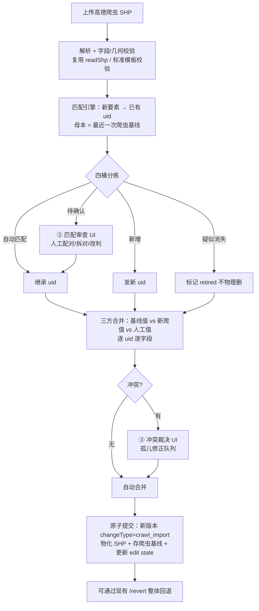

# 线网数据更新与人工修正合并设计方案（v1 定稿）

> 2026-07-14 定稿。本方案解决数据管理模块的核心痛点：**平台上的人工修改（属性/几何/删改）与周期性高德爬虫 SHP 更新互相覆盖、无法对账**。方案为增量改造，不推翻现有版本/台账/比对机制。
>
> 一句话定义：**给线路和站点发放跨导入稳定的平台内部 uid，把人工修改升格为锚定 uid 的字段级修正台账；每次爬虫更新走"认亲匹配 → 三方合并 → 冲突裁决"三步导入向导，合并结果作为一个可整体回退的新版本落盘。**

---

## 目录

1. [问题定义与现状分析](#1-问题定义与现状分析)
2. [总体设计：三层数据模型](#2-总体设计三层数据模型)
3. [稳定实体标识 uid](#3-稳定实体标识-uid)
4. [导入流水线总览](#4-导入流水线总览)
5. [匹配引擎（认亲）](#5-匹配引擎认亲)
6. [三方合并引擎](#6-三方合并引擎)
7. [爬虫基线版本](#7-爬虫基线版本)
8. [实体生命周期：retired 与复活](#8-实体生命周期retired-与复活)
9. [前端：导入向导三步 UI](#9-前端导入向导三步-ui)
10. [后端接口设计](#10-后端接口设计)
11. [数据结构定义](#11-数据结构定义)
12. [校验规则清单](#12-校验规则清单)
13. [分期实施路线](#13-分期实施路线)
14. [关键决策与风险](#14-关键决策与风险)

---

## 1. 问题定义与现状分析

### 1.1 痛点场景

1. 平台导入高德爬虫的线网/站点 SHP，人工在平台上修正属性（票价、间隔、公司、站名）、几何（移站、改线）、删改（删除已停运线路、新增规划站点）。
2. 一年后重新爬取高德数据再次上传。
3. 结果：人工修改被覆盖；且新爬数据的线路/站点 id、名称与旧数据对不上，即使想"覆盖回去"也找不到对应关系。

### 1.2 现有机制盘点（可复用的地基）

真实数据全部以 SHP 文件 + JSON 状态存磁盘，无数据库（`RealDataServiceImpl.java`，约 4800 行，下称"服务类"）：

| 机制 | 位置 | 状态 |
|---|---|---|
| 版本快照 | `_versions/<versionId>/`（完整 SHP 物化 + manifest.json），`snapshotCurrentData:2340`、`materializeVersionShp:2399` | ✅ 直接复用 |
| 操作台账 | manifest 内 `operations[]`，逐条记录 `operationId/action/targetId/changedFields/username/committedAt` | ✅ 直接复用，需加锚点字段 |
| 编辑状态与乐观锁 | `_edit_state/current-edits.json`：`revision` 单调递增 + `baseRevision/baseVersionId` 双校验（`assertFreshRevision:1978`） | ✅ 直接复用 |
| 上传先比对再确认 | `compareUpload:575` → `diffUploadedFeatures:902` → 待确认池 `pendingShpComparisons`（TTL 30min）→ 疑似删除逐项确认 | ✅ 扩展为导入向导 |
| 人工修改字段保护 | `manualProtectionForFeature:1609` 从活动台账反查人工改过的字段；`mergeUploadedFeature:1543` 合并时人工值覆盖上传值 | ⚠️ 升级为三方合并 |
| 人工改键别名 | `manualOriginalAliasesForFeature`（diff 第三轮兜底）：人工改过业务键的要素，用改前的键去认上传数据 | ⚠️ 被 uid 取代后退役 |
| 切版回退 | `/revert` → `switchActiveVersion:1949` | ✅ 直接复用 |

### 1.3 失效链路分析（为什么还是被覆盖）

`diffUploadedFeatures:902` 的匹配是三轮**精确键**兜底：

1. 业务键全等：线路 `line_id|dir|route_id`（`routeFeatureKey:1265`）、经停 `line_id|dir|stop_id|seq`、站台 `stop_id`；
2. `_featureId`（GeoTools feature id，仅单次读取内有效，跨文件基本必失配）；
3. 人工改键别名（只覆盖"人工改过键"这一种情形）。

**高德重爬后 `line_id`/`stop_id`/名称变化 → 三轮全部失配 → 旧要素判"疑似删除"、新要素判"新增" → 人工修改锚定的旧 targetId 变成孤儿 → 字段保护永远不触发 → 确认删除 + 接受新增之后，人工修改事实上被清洗。**

次级问题：即使键没变、保护触发了，规则是"人工无条件赢"（`mergeUploadedFeature:1553-1565`）——若高德侧票价真的调整了，平台会永远保留过时的人工值且无任何提示。

**结论：缺的不是机制，是（a）跨导入稳定的实体身份，（b）键失配时的模糊匹配，（c）人工值与爬虫新值都变化时的冲突呈现。**

---

## 2. 总体设计：三层数据模型

```
┌─ 修正层（人工台账）────────────────────────────────┐
│ operations[]：字段级 patch，锚定 uid                │
│ 唯一真相源：平台上"人做过什么"                        │
└──────────────────┬─────────────────────────────┘
                   │ ⊕ 三方合并（导入时）
┌─ 基础层（爬虫基线）─┴───────────────────────────────┐
│ 每次导入的原始爬虫数据（已贴 uid），只增不改            │
│ _versions/<vid>/crawl_baseline/                    │
└──────────────────┬─────────────────────────────┘
                   │ 物化
┌─ 呈现层（合并结果）─┴───────────────────────────────┐
│ _versions/<vid>/ 下的标准 SHP（含 uid、status 列）    │
│ 页面展示、导出、模型构建统一从这里读                    │
└────────────────────────────────────────────────┘
```

三条设计公理：

1. **人工修改永不直接写入基础层**——它是台账里的 patch，物化只是缓存。
2. **实体身份归平台（uid），外部键归属性**——高德 `line_id`/`stop_id`/`name` 都是可变属性，变了不影响身份。
3. **匹配与合并的比对母本是上一次爬虫基线，不是当前（含人工修改的）呈现层**——否则人工改过名的线路永远匹配不上新爬数据。

日常人工编辑链路（`mutateRealDataCollections` → `commitEdits`）**不变**，只是 operation 多带一个 `targetUid` 锚点。

---

## 3. 稳定实体标识 uid

### 3.1 发号粒度

| 实体 | uid 字段 | 粒度说明 |
|---|---|---|
| 线路方向 | `uid`（route 级） | 每个线路 SHP feature（= line+dir 一个方向）一个。上下行各自独立发号；同线双向的分组继续沿用现有 `line_id` 逻辑，分组只影响展示不影响锚定 |
| 物理站台 | `uid`（stop 级） | 每个物理唯一站台一个 |
| 经停记录 | 不发号 | 复合锚定 `route_uid + stop_uid`（+ `seq` 定位），随线路/站台身份自动稳定 |
| 场站 | `uid` | 每个场站 feature 一个 |

值：UUID v4 去横线 32 位小写十六进制（DBF char 字段，字段名 `uid` ≤10 字符合规，长度 32 < 254 合规）。

### 3.2 发号时机（三个入口，均幂等）

1. **存量迁移（一次性）**：启动时或迁移命令扫描当前活动版本，无 `uid` 列/空值的 feature 补发，物化为一个 `changeType: uid_migration` 版本。同时按"当前业务键 → uid"映射回填历史台账 operation 的 `targetUid`（映射不上的 operation 保持仅 targetId，日志报告清单）。
2. **导入认亲后**：匹配上的新要素继承旧 uid；确认为"新增"的发新号。
3. **人工新增要素**：`commitEdits` 落盘时发号。

### 3.3 锚点迁移与兼容

- operation 新增 `targetUid` 字段；`targetId`（业务键）保留为兼容与展示用途。
- `operationMatchesFeature:1646` 升级：**优先比 uid**，uid 缺失时回落现有 targetId + 别名逻辑。
- 经停关系文件 `line_stop_sequence.csv` 增列 `route_uid, stop_uid`；站点 SHP（经停粒度）同步增列。

---

## 4. 导入流水线总览



整个导入是**一个**版本、**一次**原子提交；中间状态全部挂在服务端 `importToken` 会话上（扩展现有 `pendingShpComparisons` 为带状态机的导入会话池）。

---

## 5. 匹配引擎（认亲）

### 5.1 匹配顺序

**线路 → 站台 → 经停**。站台匹配要用"途经线路集合"信号，必须在线路匹配之后；经停关系由 route+stop 匹配结果自然导出，不独立匹配。

### 5.2 预处理：名称归一化

用于名称相似度计算（不改数据本身）：trim、全角转半角、统一括号 `（）`→`()`、去除方向后缀（`(上行)`/`(下行)`/`(开往xx方向)`——方向信息由 `dir` 字段与几何端点判断）、连续空白折叠。**不去除**"路/线/专线/快"等后缀（`340路` 与 `340快线` 是不同线路）。

### 5.3 线路匹配打分

候选筛选：对基线线路建 STRtree 空间索引，新线用 bbox 外扩 200m 取候选，避免 O(n²)。

| 信号 | 权重 | 计算 |
|---|---|---|
| S1 外部键 | 短路 | `line_id\|dir\|route_id` 全等 → 直接判自动匹配（score=1.0），不再算下面各项 |
| S2 几何重叠率 | 0.5 | 基线线路 buffer 80m（可配 `match.line.bufferM`），p1 = 新线落入 buffer 的长度占比；对称计算 p2；overlap = min(p1, p2)。若正向 overlap 低，将新线反转再算一次，取高者并记 `dirFlipped` 标记 |
| S3 名称相似度 | 0.3 | 归一化名称的编辑距离相似度（1 − levenshtein/maxLen） |
| S4 端点相似 | 0.2 | 首末站名（`first`/`last` 字段）归一化后相似度均值；`dirFlipped` 时交叉比较 |

判定阈值（均可配）：

| 条件 | 结果 |
|---|---|
| score ≥ 0.85 且双向唯一（互为最佳） | 自动匹配桶 |
| 0.50 ≤ score < 0.85，或一对多/多对一 | 待确认桶（列出 top3 候选及分数） |
| score < 0.50 | 不匹配 → 新爬侧进新增桶，基线侧进疑似消失桶 |

### 5.4 站台匹配打分

候选筛选：150m 半径（可配 `match.stop.radiusM`）空间索引取候选。`stop_id` 全等短路判自动匹配。

| 信号 | 权重 | 计算 |
|---|---|---|
| 距离 | 0.4 | 1 − d/150，d 为球面距离 |
| 名称相似度 | 0.4 | 同 5.3 S3 |
| 途经线路 Jaccard | 0.2 | 双方途经线路映射为 route_uid 集合（新爬侧用已完成的线路匹配结果换算）后的 Jaccard 系数 |

阈值同 5.3（自动 ≥0.85 / 待确认 0.5–0.85 / 不匹配 <0.5）。

### 5.5 场站匹配

字段不固定（现状即如此，`compareUpload:603` 注释），仅用 名称相似 0.5 + 距离 0.5（300m 半径），阈值同上。

### 5.6 待确认桶的人工操作

- **配对**：从候选列表选一个，或搜索任意基线实体手动指定；
- **拆对**：推翻某个自动匹配（自动匹配桶默认折叠但可展开抽查）;
- **判新增 / 判停运**：显式改判；
- 全部待确认项清空（或用户显式选择"剩余按推荐处理"）才能进入下一步。

---

## 6. 三方合并引擎

### 6.1 输入

对每个匹配上的 uid、每个非派生业务字段 f：

- `old` = 上一次爬虫基线中该实体的 f 值（见 §7；实体不在基线中则 old 缺位）；
- `new` = 本次上传的 f 值；
- `cur` = 当前呈现层的 f 值；
- `manual` = f ∈ 该 uid 的人工修改字段集（从活动台账取，即现有 `manualProtectionForFeature` 逻辑改为按 uid 索引）。

### 6.2 字段级合并规则

| manual | 值关系 | 结果 | 说明 |
|---|---|---|---|
| 否 | — | 取 `new` | 爬虫是无人工痕迹字段的权威来源 |
| 是 | `old == new` | 保 `cur` | 爬虫没有新信息，人工优先 |
| 是 | `old != new` | **冲突** → 裁决队列 | 呈现"基线值 / 你的修改 / 新爬值"三列，人选 |
| 是 | `old` 缺位 | 保 `cur`，且若 `new != cur` 记为**低置信冲突**（默认预选保人工） | 首次导入/人工新增实体无基线 |

几何（`GEOMETRY_FIELD`）走同一张表：无人工几何修改 → 信新爬；有 → 冲突（地图叠加对比裁决）。

### 6.3 存在性合并规则

| 情形 | 结果 |
|---|---|
| 人工删除过的实体，新爬又出现 | 冲突（默认预选"维持删除"；现状是静默 skip，升级为显式呈现） |
| 人工新增的实体（无基线、无新爬对应） | 保留，不受导入影响 |
| 人工新增的实体与某新爬实体高度重合（score ≥ 0.85） | 待确认桶提示"疑似重复，建议合并"（合并 = 人工实体让位、修正字段转挂新 uid） |
| 基线有、新爬没有 | retired（见 §8），不物理删 |

### 6.4 孤儿修正队列

活动台账中锚定的 uid 若在本次合并后不存在（被确认删除/合并让位），其 operations 进孤儿队列：**人工选择"改挂到某 uid"或"作废"，绝不静默丢弃**。作废也写入台账（`action: orphan_discarded`）留痕。

### 6.5 经停关系（seq）特殊规则

- 人工做过 `reorder_line_stations` 的线路：若新爬的站点集合（stop_uid 集）与当前一致 → 保人工顺序；集合有增删 → 整线经停进冲突（呈现两列站序对比，人选"取新爬顺序"或"取新爬集合+尽量保人工相对顺序"）。
- 未人工动过经停的线路 → 整体取新爬。

---

## 7. 爬虫基线版本

- 每次导入 commit 时，把**认亲后（已贴 uid）的原始上传数据**原样另存到本版本目录：`_versions/<versionId>/crawl_baseline/`（线路/站点/场站 SHP + 经停 CSV，与呈现层同构）。
- manifest 增 `changeType: "crawl_import"`（现有 changeType 枚举扩展）。
- **基线查找规则**：沿版本链（`baseVersionId`）向上找最近一个 `crawl_import` 版本的 `crawl_baseline/`。这样 `/revert` 切版后基线自动跟着版本走，无独立指针要维护。
- 首次使用本方案导入时无历史基线 → 全体人工字段走 §6.2 第四行的退化规则（低置信冲突），一次性人工过账后即步入正轨。

---

## 8. 实体生命周期：retired 与复活

- 呈现层 SHP 增 `status` 列：`active` / `retired`（DBF char，字段名合规）。
- "疑似消失"确认后置 `retired` 并记 `retiredAt`（写台账 operation），**不从 SHP 删除行**——爬虫漏爬很常见，物理删会把 uid 和挂在上面的人工修正一起陪葬。
- retired 实体默认不进前端展示与模型构建（读取侧按 `status=active` 过滤，前端可开"显示已停运"开关）。
- 下次导入若匹配回 retired 实体 → 自动复活（置回 active，写台账），人工修正无损恢复。
- 人工也可在属性表里手动 retire/复活（替代一部分"删除"场景；真正的误导入数据仍可走现有删除）。

---

## 9. 前端：导入向导三步 UI

入口：数据管理页现有"上传比对"按钮升级为"导入更新"，打开 `ImportWizardDialog.vue`（新组件，挂在 `datamanagement/index.vue`）。

```
┌─ 导入更新 · 步骤 ② 匹配审查 ──────────────────────────────────────────┐
│ [① 上传解析] ─ [② 匹配审查] ─ [③ 冲突裁决与提交]                        │
│ ┌─ 分桶清单 ──────────────┐ ┌─ 地图对比 ────────────────────────────┐ │
│ │ ▸ 自动匹配 1873 (折叠)   │ │   旧(基线)=灰  新(上传)=蓝  选中高亮     │ │
│ │ ▾ 待确认 41             │ │   [仅看选中] [双图并排/叠加 切换]        │ │
│ │  ⚠ 340路(上行)          │ │                                        │ │
│ │    候选1 340路 0.82 ◉   │ │          （MapLibre 画布）              │ │
│ │    候选2 340快 0.61 ○   │ │                                        │ │
│ │    [手动搜索][判新增]     │ │                                        │ │
│ │ ▸ 新增 37  ▸ 疑似停运 12 │ └────────────────────────────────────────┘ │
│ └─────────────────────────┘  待确认剩 41 项    [上一步] [下一步(禁用)]  │
└──────────────────────────────────────────────────────────────────────┘
```

- **步骤①**：拖拽上传（复用现有 FormData 通道），展示解析结果与字段校验报告。
- **步骤②**：四桶分栏 + 地图对比。清单用虚拟滚动（沿用页面既有性能约定）；地图叠加图层配色走 `mapTheme.js` 统一令牌。
- **步骤③**：冲突表格（行 = uid×字段：基线值/人工值/新爬值三列 + 单选），支持"本页全部保人工/全部取新值"批量操作但需二次确认；孤儿修正队列同屏；底部提交（填写 `message`，沿用现有提交样式与 evidenceImages 能力）。
- 提交后 toast + 跳转历史面板（`HistoryPanel.vue`）查看新版本；回退走现有入口。
- 新增 el-* 组件时同步登记 `element-plus.js` + `element.scss`（项目既有约定）。

---

## 10. 后端接口设计

导入会话池：`pendingShpComparisons` 扩展为 `importSessions`（token → 状态机 `PARSED → MATCH_CONFIRMED → RESOLVED → COMMITTED`，TTL 沿用 30min，每次交互续期）。

| 接口 | 方法 | 职责 |
|---|---|---|
| `/pt/real-data/import/upload` | POST (multipart) | 解析校验 + 跑匹配引擎，返回 `importToken` + 四桶结果 + 统计 |
| `/pt/real-data/import/confirmMatch` | POST | 提交人工配对/拆对/改判；服务端据此跑三方合并，返回冲突清单 + 孤儿队列 + 合并预览统计 |
| `/pt/real-data/import/resolve` | POST | 提交冲突裁决与孤儿处置，返回最终 operations 预览 |
| `/pt/real-data/import/commit` | POST | 原子落盘：新版本 + crawl_baseline + edit state；`baseRevision/baseVersionId` 乐观锁校验同现有 `commitEdits` |
| `/pt/real-data/import/session/{token}` | GET/DELETE | 会话查询（断线恢复向导）/放弃 |

兼容策略：现有 `compareUpload`/`confirmUpload` 保留服务小范围 SHP 修补场景，前端主入口切到新向导；待新链路稳定后旧接口标记废弃。

匹配引擎实现在服务类旁新建 `RealDataMatchEngine.java`（纯函数式，输入两组 FeatureCollection + 参数，输出匹配结果），便于脱离 Spring 独立测试（沿用线网优化裁剪测试的做法）。

---

## 11. 数据结构定义

### 11.1 SHP 新增列

| 数据集 | 新增列 | 类型 |
|---|---|---|
| 线路 | `uid` char(32)、`status` char(8) | 全部数据集统一 |
| 站点（经停） | `uid`(=stop uid) char(32)、`route_uid` char(32) | |
| 物理站台 | `uid` char(32)、`status` char(8) | |
| 场站 | `uid` char(32)、`status` char(8) | |

`line_stop_sequence.csv` 增列：`route_uid, stop_uid`。

### 11.2 operation 扩展字段

```jsonc
{
  "operationId": "…",            // 现有
  "action": "replace",           // 现有；新增枚举 retire / revive / orphan_discarded / rebind
  "targetId": "340|0|xxx",       // 现有，降级为展示/兼容
  "targetUid": "9f8a…",          // 新增：主锚点
  "source": "manual | crawl_import",  // 现有 source 语义扩展
  "changedFields": ["price"],    // 现有
  "baseValues": {"price": "2"},  // 新增：修改时的基线侧旧值快照（三方合并的兜底证据）
  "importId": "imp_20270701_ab12" // 新增：crawl_import 来源的批次号
}
```

### 11.3 匹配结果（importToken 会话内 & 返回前端）

```jsonc
{
  "importToken": "imp_…",
  "buckets": {
    "auto":      [{ "uid": "…", "score": 0.97, "dirFlipped": false, "uploadedKey": "…" }],
    "review":    [{ "uploadedKey": "…", "candidates": [{ "uid": "…", "score": 0.82, "signals": {"geom":0.78,"name":0.91,"ends":0.75} }] }],
    "added":     [{ "uploadedKey": "…" }],
    "retiring":  [{ "uid": "…", "name": "…" }]
  },
  "stats": { "auto": 1873, "review": 41, "added": 37, "retiring": 12 }
}
```

### 11.4 冲突项

```jsonc
{
  "uid": "…", "entityLabel": "340路(上行)",
  "field": "price",
  "baseValue": "2", "manualValue": "3", "newValue": "2.5",
  "confidence": "normal | low",       // low = 无基线退化情形
  "defaultChoice": "manual",
  "resolution": null                   // 前端回填 manual | new | custom(值)
}
```

### 11.5 manifest 扩展

`changeType` 增 `crawl_import` / `uid_migration`；crawl_import 版本增 `importSummary`（四桶统计、冲突数、裁决人、参数快照 buffer/半径/阈值）。

---

## 12. 校验规则清单

1. 提交前：待确认桶清零（或显式确认"按推荐处理"）；冲突全部有 resolution；孤儿全部有处置。
2. `commit` 时 `baseRevision/baseVersionId` 乐观锁校验，失败提示"数据已被他人修改，请重新比对"（同现有语义）。
3. uid 全局唯一性校验（物化前扫重）；物化 SHP 时 `uid`/`status` 列必写、不允许空。
4. 导入原子性：物化、基线落盘、edit state 更新在同一提交流程内完成，任一失败整体回滚（删除半成品版本目录）。
5. 匹配参数（buffer、半径、阈值、权重）写入 importSummary，保证事后可复盘"为什么这么配的对"。
6. 存量 uid 迁移必须先 dry-run 输出报告（发号数、台账回填成功/失败清单）再执行。
7. retired 实体参与匹配池（否则无法复活），但不参与"新增判重"以外的展示。
8. 派生字段（`len_km/directness/stop_count/avg_stop_m/route_cnt`）一律不进合并与冲突（现有 `DERIVED_FIELDS` 过滤沿用）。

---

## 13. 分期实施路线

| 期 | 内容 | 交付判定 |
|---|---|---|
| **P0 身份地基** | uid 发号 + 存量迁移（含 dry-run 报告）；operation 双锚点（targetUid + baseValues）；`operationMatchesFeature` 优先 uid；导入/提交时落 crawl_baseline；`status` 列与读取侧过滤 | 人工编辑一条属性 → 台账带 uid 锚点；切版/回退不丢 uid |
| **P1 匹配引擎** | `RealDataMatchEngine`（线路/站台/场站打分 + 四桶）+ 独立单测（小母本）；导入向导 ①② 步 + 新接口 upload/confirmMatch | 用改名+改 id 的模拟新爬数据导入，人工修改过的线路能全部认回 |
| **P2 三方合并** | 合并引擎 + 冲突裁决/孤儿队列 UI + resolve/commit 接口 + retired 生命周期 | 端到端：爬虫值变+人工值在 → 出冲突且裁决生效；爬虫没变 → 人工保留零冲突 |
| **P3 打磨（可选）** | 匹配参数调优界面；批量裁决策略预设；导入报告导出；旧 compareUpload 下线 | — |

P0 不依赖 P1/P2 即可单独上线（现有比对逻辑照跑，但身份和基线从此开始积累——**越早上 P0，一年后的那次导入越有救**）。

---

## 14. 关键决策与风险

| # | 决策/风险 | 说明 |
|---|---|---|
| D1 | **不引入数据库**，继续 SHP + JSON 文件化 | 与现有架构一致；uid/status 存 DBF 列，台账存 manifest。引 DB 是另一场手术，本方案不做 |
| D2 | uid 粒度 = 线路方向 + 物理站台 | 经停不发号，复合锚定；双向分组沿用 line_id，仅展示用途 |
| D3 | 匹配以**几何重叠为主信号**（权重 0.5） | 改名/改 id 都救得回来；名称只是辅助 |
| D4 | 无冲突时人工修改**永远优先**；有冲突**必须人工裁决**，初版不做自动策略 | 宁可多点几下，不能静默错 |
| D5 | 疑似消失一律 retired 不物理删 | 防爬虫漏爬陪葬人工修正 |
| R1 | buffer/阈值参数敏感（郊区长线、并线路段） | 参数可配 + 待确认桶兜底 + importSummary 留参数快照；P1 用真实数据标定默认值 |
| R2 | 全量几何重叠计算性能（2000+ 线） | STRtree 候选筛选后为局部计算，预估秒级；超时兜底：先键匹配短路再几何 |
| R3 | 存量台账 targetUid 回填可能有认不上的 | dry-run 报告 + 认不上的保持 targetId 兜底匹配，不阻塞上线 |
| R4 | DBF 字段名 ≤10 字符、字段数上限 | 新增列名已合规（uid/status/route_uid）；物化时校验 |
| R5 | 导入会话内存态（TTL 30min）断线丢进度 | session GET 支持恢复；步骤②③ 的人工决定随每次交互即时写入会话；必要时 P3 把会话落盘 |
